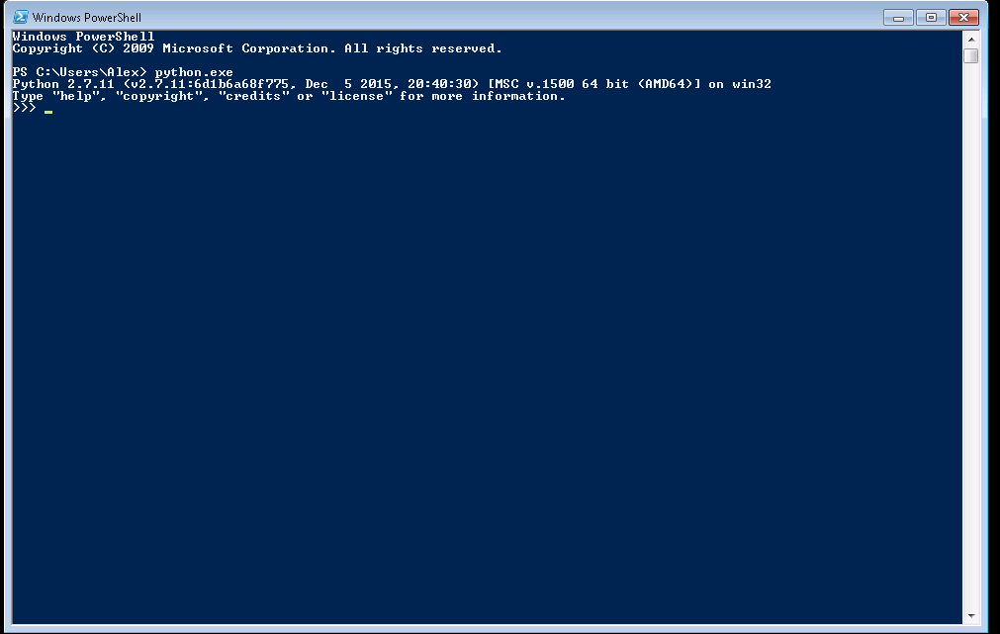

Python REPL, basic types, binary
======


### Python REPL (Shell) basics

REPL stands for Read, Eval, Print loop. It's an interactive language shell, much like command line shell it interactively executes commands, but unlike command prompt, these aren't somewhat arcane shorthand commands, but proper python syntax.

Start up Windows PowerShell, and run Python shell inside of it by typing `python.exe`



When python shell starts, it displays some information about the environment, such as Python version, build number, build date and time, compiler and system architecture. The next line shows some shorthand commands to get users start with python: `help`, `copyright`, `credits` and `license`. You can type these command in REPL to get started.

The final line is shell prompt, it's signified by `>>>` symbol and means that python is ready to accept your input.

Every line that doesn't start with `>>>` prompt or `...` prompt (on that later), means that everything that's displayed on the line is either your program output, or python interpreter output in case your program crashed.

### "Hello, world", basic types


Printing out "Hello, World" through REPL


```python
>>> print("Hello, world!")
Hello, world!
```


Variable assignment in python

```python
>>> a = "Hello, world"
>>> b = 94
>>> c = 0.99
>>> print(a)
Hello, world!
>>> print(b)
94
>>> print(c)
0.99

```

Here's the expression print `print(a)` does the same thing as `print("Hello, world!")` as variable `a` is assigned value `"Hello, world!"`

Python is dynamically typed language, so the type of each variable don't have to be specified when defining it, also the type as well as the value can change throughout the program.


```python
>>> print(a)
Hello, world!
>>> a = 30
>>> print(a)
30
```

Python is strongly typed language, meaning it can change one type of value into another if there exist certain rules of conversions between the kinds of values, but if they are none, that would generate an error.

For example Python knows how to generate integer into a decimal number

```python
>>> 20 + 33.3
53.3
```

But if you want to combine integer and a string, this would fail

```python
>>> "The number is: " + 55
Traceback (most recent call last):
  File "<stdin>", line 1, in <module>
TypeError: cannot concatenate 'str' and 'int' objects
```

You need to follow one of the conversion rules:

1. Explicitly converting integer to string

```python
>>> "The number is " + str(55)
'The number is 55'
```

2. Using format() method

```python
>>>> "The number is {}".format(55)
'The number is 55'
```


3 Using sprintf formating function (kind of deprecated)

```python
>>> "The number is %d" % 55
'The number is 55'
```

These basic types are building blocs to more complicated structures used in programming, but these types themselves are just different representations of numbers in binary system, you can see any value represented in binary by passing it to this method `"{0:b}".format(55)`

```python
>>> "{0:b}".format(0)
'0'
>>> "{0:b}".format(1)
'1'
>>> "{0:b}".format(2)
'10'
>>> "{0:b}".format(3)
'11'
>>> "{0:b}".format(4)
'100'
>>> "{0:b}".format(8)
'1000'
>>> "{0:b}".format(16)
'10000'
```

Strings are multiple instances of a number so decoding whole string at once is not always possible, but it is possible to decode one character at a time.

The function 'ord' decodes a character into its ASCII code

```python
>>> ord('H')
72
```

**Exercise:** Try getting all the values for the word 'Hello'

The function 'chr' does the opposite and converts integers into characters

```python
>>> chr(72)
'H'
```

**Exercise:** Verify that you converted all the values of the word 'Hello' correctly by

Characters are just numbers with special meaning see [ASCII table](http://www.asciitable.com/), through useful at one point ascii encoding has sever limitation of only supporting English language, to address the limitation Unicode was created, but it is much more complicated

Floating point numbers as everything is encoded in binary using IEEE754 standard, but actually showing that is somewhat more involved, you could try [IEEE 756 Converter](http://www.h-schmidt.net/FloatConverter/IEEE754.html)

