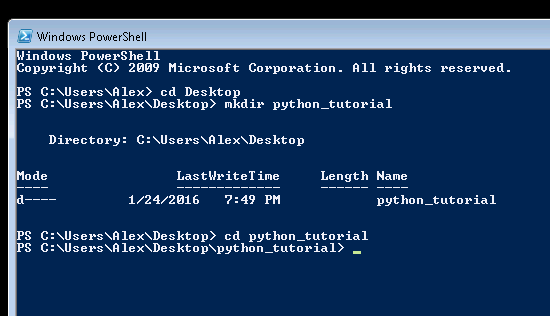
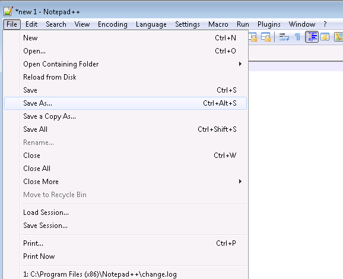
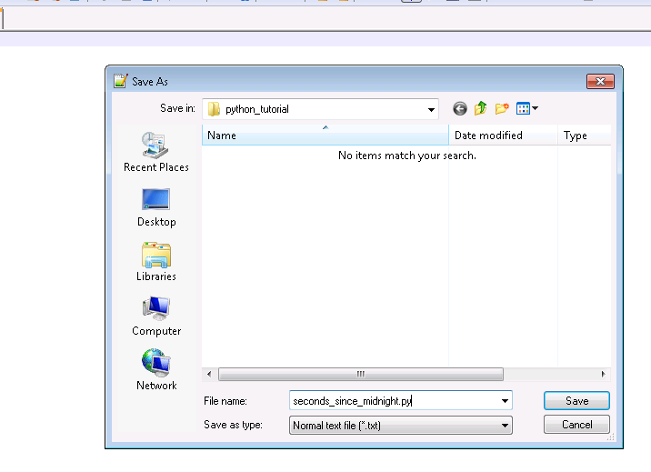
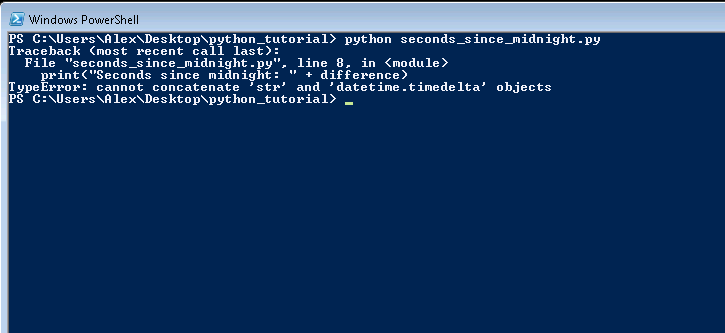
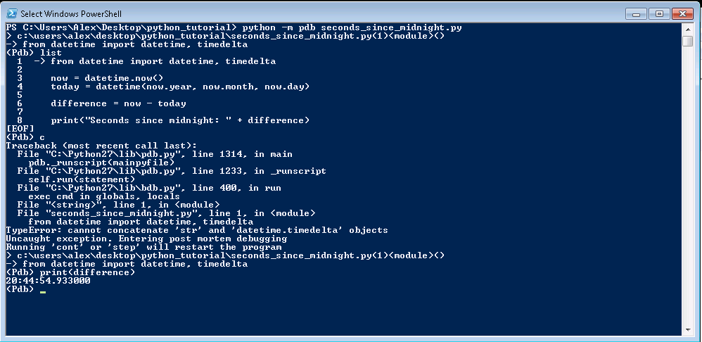

Debugging, working with datetime, classes
======

The examples used so far are easy to try out, but it is not possible to save the work for later.

For that case we will save program code into a text file and then feed that text file to python interpreter.

# Preparation

Open Windows Power Shell and go to your Desktop, where create a folder called 'python_tutorial'.

Open Notepad++ by going to 'Start Menu' -> typing Notepad, then clicking on Notepad++.



We're going to use python datetime standard module, meaning whenever python is installed this module is available.

[Datetime documentation](https://docs.python.org/2/library/datetime.html)

* [datetime.timedelta](https://docs.python.org/2/library/datetime.html#datetime.timedelta)
* [datetime.datetime](https://docs.python.org/2/library/datetime.html#datetime.datetime)

# The Code

Create a new file by pressin Ctrl+N, then go to File -> Save As...



Go ptyho_tutorial directory on Desktop and set the filename to `seconds_since_midnight.py`.



After the file has been saved, Notepad++ will detect it's a python file and turn on appropriate syntax highlighting and autocomplete.

Type the following into notepad++, then press Ctrl+S to save

```python

from datetime import datetime, timedelta

now = datetime.now()
today = datetime(now.year, now.month, now.day)

difference = now - today

print("Seconds since midnight: " + difference)

```

Now open Windows PowerShell and go to `Desktop\python_tutorial` then run the program:

```
python seconds_since_midnight.py
```



As you see right now, the program doesn't work. We are going to debug it. See how this term has come about in [Wikipedia article](https://en.wikipedia.org/wiki/Debugging#Origin)

There's problem mashing a `datetime.timedelta` object with a string, first thing we can do is to print out just the `difference` object and see how it looks, this approach will work just fine for a small program, however for larger programs especially the once that output lots of things to the console, the output might get drown out by other things. Another problem is that we're changing the source code, and after we're done we'll have to go and hunt for all the print statements; source control tools partially solve the problem, but do we really need to write code that we're never going to run?


# Debugging

An easier solution is to use [python debugger -- pdb](https://docs.python.org/2/library/pdb.html). Basically it gives us python REPL with all of the variables already loaded, so we can try and determine what is about to go wrong with the program.
After reading the error message, we know that the program is going to crash on line ` N  ` with the error message `  `. So on the line ` N - 1 ` we're gonna add this statement that imports debugger module and activates the debugger

```python
import pdb; pdb.set_trace()
```

There are few commands available like `n` - execute next line, `c` - continue running the program or `q` - quit the program.

**Exercise:** try these commands, as they promptly crash the program.

This investigating technique is effective when program doesn't crash and you're just looking for the code looking where things might have gone wrong, in this case, we can use post-mortem debugger, where you don't need to modify any source code as the debugger gets loaded after program crashes


```
    python -m pdb seconds_since_midnight.py
```



The program will initially start in debug mode, press `c` so the code will execute until an uncaught exception occurs.
Other then running debugger commands, list what line is currently executing by typing `list`.  You can run python code, in our case let's see what `difference` variable has inside, and if it can display seconds.


# Exercises

**Exercise:** See the documentation for [datetime.timedelta](https://docs.python.org/2/library/datetime.html#datetime.timedelta) to figure out how to extract seconds from timedelta. Then print out the number of seconds as a part of "Seconds since midnight" string with your favorite string formatting method.

**Exercise:** display seconds as an integer and not floating point number. How would you do conversion?
