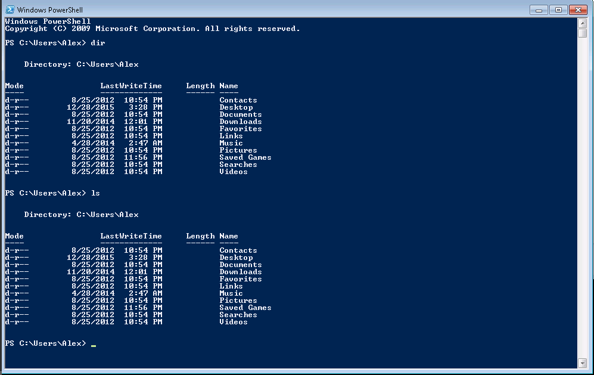

Pylading commad line and introduction to python tutorial
=======

Tools to use:

* command prompt
* power shell
* Notepad++
* python 2.7
* git bash

#Unix Shell

Scope -- general introduction to shell, files and directories, running programs, copy and paste in windows shell; power shell, git bash shell (just mention).

Compare shell to windows explorer
Compare shell to a program source code

# Introduction

http://swcarpentry.github.io/shell-novice/00-intro.html

Command line interpreter, command line shell, command prompt or command language interpreter (CLI) are computer programs designed to interpret a sequence of lines of text in order to run programs, store data, communicate with each other and to interact with us.

The Unix shell has been around longer than most of its users have been alive. It has survived so long because it’s a power tool that allows people to do complex things with just a few keystrokes. More importantly, it helps them combine existing programs in new ways and automate repetitive tasks so that they don’t have to type the same things over and over again

CLI, to distinguish it from a graphical user interface, or GUI, which most people now use. The heart of a CLI is a read-evaluate-print loop, or REPL: when the user types a command and then presses the enter (or return) key, the computer reads it, executes it, and prints its output. The user then types another command, and so on until the user logs off.

[Copyright © Software Carpentry](http://swcarpentry.github.io/shell-novice/LICENSE.html)

# Working with files and directories

The part of the operating system responsible for managing files and directories is called the file system. It organizes our data into files, which hold information, and directories (also called “folders”), which hold files or other directories.

## Navigating the file system.

Starting Windows Command Prompt: Press on Start then type `cmd`
Starting Power Shell: Press on Start then type `powershell`
Starting Windows Explorer: Press on Start then type `explorer`

This tree programs are displaying location on the filesystem, Power Shell and Command Prompt starts in `C:\Users\<Your User Name>` but Windows Explorer cheats, and displays pseudo-location 'Libraries'.

Switching to the same directory in Windows Explorer as in both shells is easy, just type the full path in the text field where libraries are, then press `Enter`

## Listing directory contents

Windows Explorer shows path to the directory at the top and the contents of the directory in the main windows. To show contents of the directory in shell, use command `dir`. At this point we're going to close Command Prompt as Windows Shell supersedes it, by having better features and generally being a lot less annoying.

There's an alternative command `ls` or short of *list*, the difference is mostly historical one, `dir` being mostly used by windows predecessor -- [CP/M](http://discordia.org.uk/px4/cpm.html) in the 1970s, and `ls` first used in Unix, but it races its roots to `listf` available on [Massachusetts Institute of Technology's Compatible Time Sharing System](http://www.tldp.org/LDP/LG/issue48/fischer.html) in July 1961. Power Shell processes both command.

## Changing the directories

cd

## Creating Directories

mkdir

## Creating Files with Notepad

A brief digression -- install Notepad++ (much better editor than Notepad)

Also show creating files with echo

    echo 'this is a test' > test_file.txt

Reading the file with `cat`

    cat test_file.txt

Reading the file with Notepad++

### Creating first python program.

Brief digression -- installing Python 2.7

Go to python.org download section for windows -- https://www.python.org/downloads/release/python-2711/

Download `Windows x86-64 MSI Installer` -- https://www.python.org/ftp/python/2.7.11/python-2.7.11.amd64.msi

## Deleting Files & Directories

http://cc.vrplumber.com/scripts.html#getting-to-the-command-prompt
http://swcarpentry.github.io/shell-novice/01-filedir.html

# References

* http://swcarpentry.github.io/shell-novice/