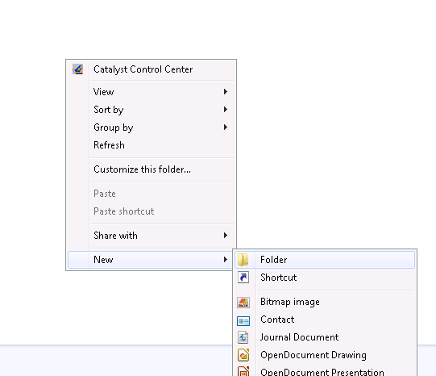
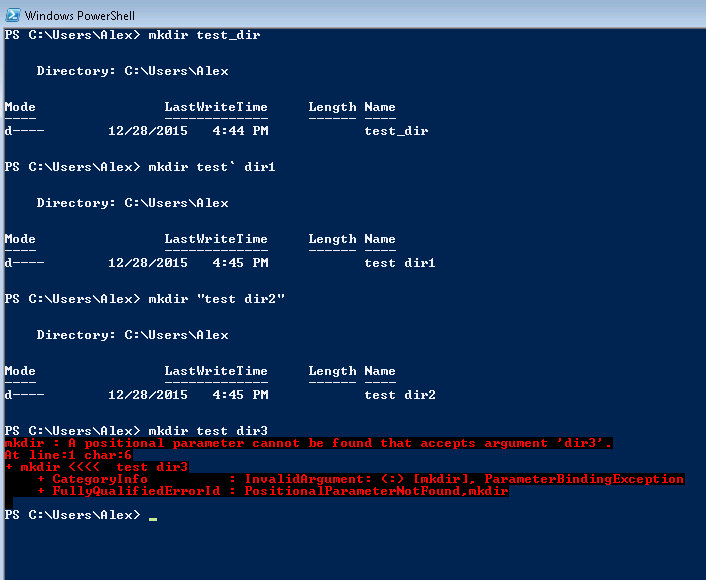
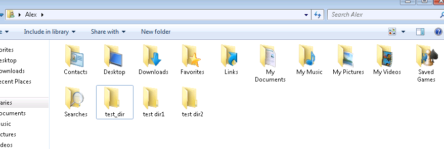
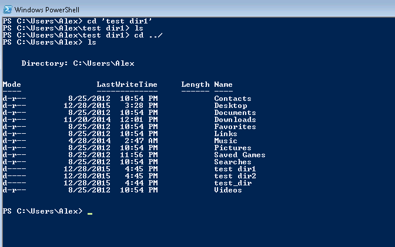
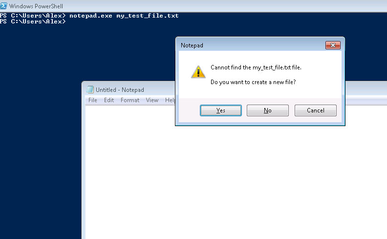
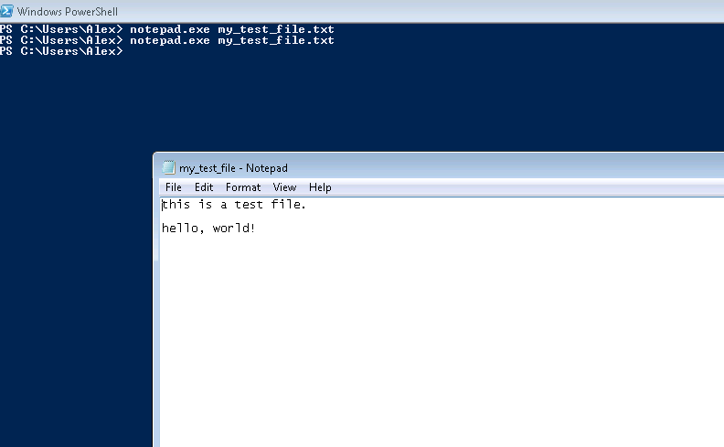
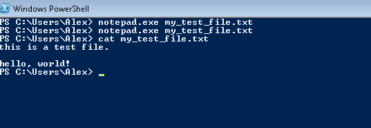
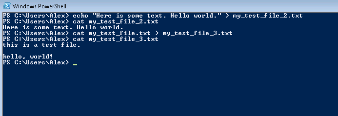

PyLadies command line and introduction to Python tutorial
=======

Tools to use:

* command prompt
* power shell
* Notepad++
* python 2.7
* git bash

#Unix Shell

Scope -- general introduction to shell, files and directories, running programs, copy and paste in windows shell; power shell, git bash shell (just mention).

Compare shell to windows explorer
Compare shell to a program source code

# Introduction

http://swcarpentry.github.io/shell-novice/00-intro.html

Command line interpreter, command line shell, command prompt or command language interpreter (CLI) are computer programs designed to interpret a sequence of lines of text in order to run programs, store data, communicate with each other and to interact with us.

The Unix shell has been around longer than most of its users have been alive. It has survived so long because it’s a power tool that allows people to do complex things with just a few keystrokes. More importantly, it helps them combine existing programs in new ways and automate repetitive tasks so that they don’t have to type the same things over and over again

CLI, to distinguish it from a graphical user interface, or GUI, which most people now use. The heart of a CLI is a read-evaluate-print loop, or REPL: when the user types a command and then presses the enter (or return) key, the computer reads it, executes it, and prints its output. The user then types another command, and so on until the user logs off.

[Copyright © Software Carpentry](http://swcarpentry.github.io/shell-novice/LICENSE.html)

# Working with files and directories

The part of the operating system responsible for managing files and directories is called the file system. It organizes our data into files, which hold information, and directories (also called “folders”), which hold files or other directories.

## Navigating the file system.

Starting Windows Command Prompt: Press on Start then type `cmd`
Starting Power Shell: Press on Start then type `powershell`
Starting Windows Explorer: Press on Start then type `explorer`

This tree programs are displaying location on the filesystem, Power Shell and Command Prompt starts in `C:\Users\<Your User Name>` but Windows Explorer cheats, and displays pseudo-location 'Libraries'.

Switching to the same directory in Windows Explorer as in both shells is easy, just type the full path in the text field where libraries are, then press `Enter`

## Listing directory contents

Windows Explorer shows path to the directory at the top and the contents of the directory in the main windows. To show contents of the directory in shell, use command `dir`. At this point we're going to close Command Prompt as Windows Shell supersedes it, by having better features such as more shell commands, command auto-completion and generally being a lot less annoying.

There's an alternative command `ls` or short for *list*, the difference is mostly historical one, `dir` being mostly used by windows predecessor -- [CP/M](http://discordia.org.uk/px4/cpm.html) in the 1970s, and `ls` first used in Unix, but it races its roots to `listf` available on [Massachusetts Institute of Technology's Compatible Time Sharing System](http://www.tldp.org/LDP/LG/issue48/fischer.html) in July 1961. Power Shell processes both command.

## Creating Directories

Creating directories in Windows Explorer -- Right click; New -> Folder

Creating directories in command line is just as easy with `mkdir`. There is one caveat though, Power Shell or any shell for that matter use space to separate different command line parameters, so if you want to have a directory name with spaces in it, you need to either quote the whole statement, or add an escape tick in power shell or backslash in Unix before using space symbol.

For example the following commands work

     mkdir test_dir
     mkdir test` dir1
     mkdir "test dir2"

And the following command doesn't it's got an unescaped space, then turns one parameter into a list of two parameter, and Power Shell doens't know how to deal with that.

    mkdir test dir3

There is nothing special about the directories we created and they show as regular directories in Windows Explorer.

## Changing the directories

Change directory (cd) move between different directories, same as double click in Windows Explorer, and much like `mkdir` the command treats spaces in file name much the same way.

    cd 'test dir1'

List the content -- it is empty

    ls

For historical reasons '.' signifies current directory, '..' signify a parent directory. So to go up one level we use the following command --

    cd ..

Listing directories again

    ls

## Creating Files

From the command line start a notepad and give it a file name. Yes you could do that.

    notepad.exe my_test_file.txt

What happened here, is when you gave a filename to notepad, it checked if the file existed when it turned out that it didn't, notepad program asked you to what to do. Choose that you want to create the file. Write some text in it, then save and close it. Once you run that command again, you will notice that notepad just loads the file.

But using notepad in this case is not necessary, there's a command-line utility that reads a file and outputs it content to the same shell it's been launched avoiding starting GUI application in the first place.

    cat my_test_file.txt

We can also use command line text editors to change the content of the files, and unix-like systems usually come with a handful of those i.e. vi, nano, ed. But for the demonstration purposes I'll use redirection operator `>`, that instead of standard output (screen) redirects output into a file or as input to another program. I will use `echo` a program that prints to standard output whatever is given to it as an argument.

    echo "Here is some text. Hello world." > my_test_file_2.txt

You can copy file with redirect operator

    cat my_test_file.txt > my_test_file_3.txt

A brief digression -- install Notepad++ (much better editor than Notepad)

Go to https://notepad-plus-plus.org/download/v6.8.8.html download and install notepad++

### Using a buffer with Power Shell: copying and pasting text.

To copy text, point cursor to the beginning of the selection, drag the mouse while holding the button. Once selection is complete hit 'Enter' on the keyboard.
The text will be copied in the buffer.

Pasting text into shell window can be accomplished by right-clicking on window title then selecting Edit -> Paste

## Deleting Files & Directories

Deleting files and directories is done with the following command

rm -- delete a file, or delete files directories recursively
rmdir -- delete empty directories

### Creating first python program.

Brief digression -- installing Python 2.7

Go to python.org download section for windows -- https://www.python.org/downloads/release/python-2711/

Download `Windows x86-64 MSI Installer` -- https://www.python.org/ftp/python/2.7.11/python-2.7.11.amd64.msi

# References

* http://swcarpentry.github.io/shell-novice/
* http://cc.vrplumber.com/scripts.html#getting-to-the-command-prompt
* http://swcarpentry.github.io/shell-novice/01-filedir.html