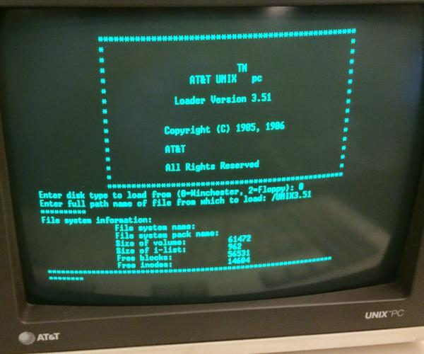

# Introduction

[Source](http://mightyframe.blogspot.ca/2014/10/ldrcpy-at-unix-pc-system-install-clues.html)

Command line interpreter, command line shell, command prompt or command language interpreter (CLI) are computer programs designed to interpret a sequence of lines of text in order to run programs, store data, communicate with each other and to interact with us.

The Unix shell has been around longer than most of its users have been alive. It has survived so long because it’s a power tool that allows people to do complex things with just a few keystrokes. More importantly, it helps them combine existing programs in new ways and automate repetitive tasks so that they don’t have to type the same things over and over again

CLI, to distinguish it from a graphical user interface, or GUI, which most people now use. The heart of a CLI is a read-evaluate-print loop, or REPL: when the user types a command and then presses the enter (or return) key, the computer reads it, executes it, and prints its output. The user then types another command, and so on until the user logs off.

http://swcarpentry.github.io/shell-novice/00-intro.html

[Copyright © Software Carpentry](http://swcarpentry.github.io/shell-novice/LICENSE.html)

|Previous|Next|
|--------|----|
|[README](../README.md)|[Filesystem Navigation](0002_filesystem_navigation.md)|