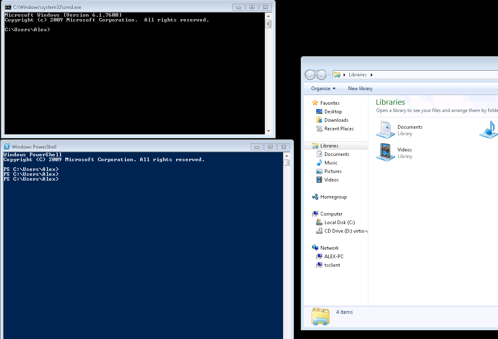
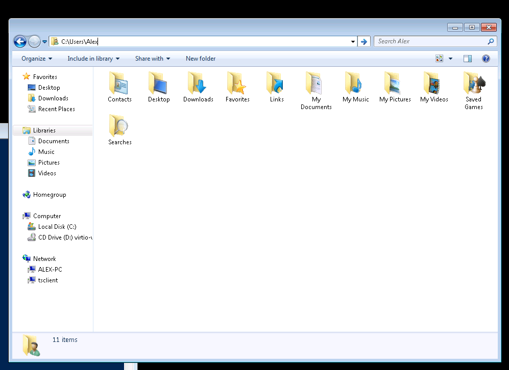

# Working with files and directories

The part of the operating system responsible for managing files and directories is called the file system. It organizes our data into files, which hold information, and directories (also called “folders”), which hold files or other directories.

## Navigating the file system.

Starting Windows Command Prompt: Press on Start then type `cmd`
Starting Power Shell: Press on Start then type `powershell`
Starting Windows Explorer: Press on Start then type `explorer`

This tree programs are displaying location on the filesystem, Power Shell and Command Prompt starts in `C:\Users\<Your User Name>` but Windows Explorer cheats, and displays pseudo-location 'Libraries'.

Switching to the same directory in Windows Explorer as in both shells is easy, just type the full path in the text field where libraries are, then press `Enter`

|Previous|Next|
|--------|----|
|[Intro](0001_intro.md)|[Directories](0003_directories.md)|