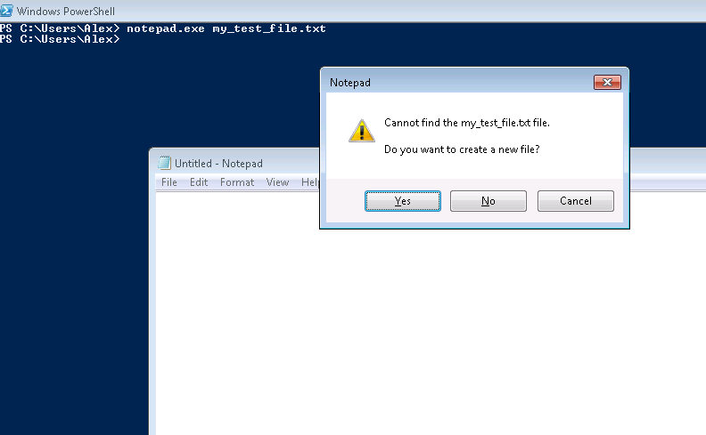
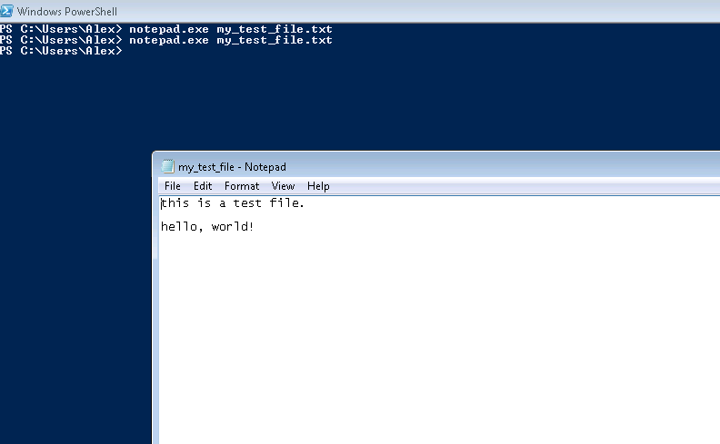
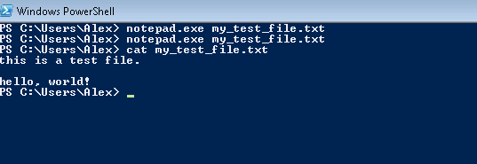
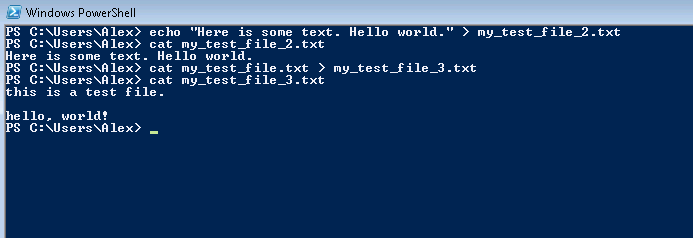

## Creating Files

From the command line start a notepad and give it a file name. Yes you could do that.

    notepad.exe my_test_file.txt

What happened here, is when you gave a filename to notepad, it checked if the file existed when it turned out that it didn't, notepad program asked you to what to do. Choose that you want to create the file. Write some text in it, then save and close it. Once you run that command again, you will notice that notepad just loads the file.

But using notepad in this case is not necessary, there's a command-line utility that reads a file and outputs it content to the same shell it's been launched avoiding starting GUI application in the first place.

    cat my_test_file.txt

We can also use command line text editors to change the content of the files, and unix-like systems usually come with a handful of those i.e. vi, nano, ed. But for the demonstration purposes I'll use redirection operator `>`, that instead of standard output (screen) redirects output into a file or as input to another program. I will use `echo` a program that prints to standard output whatever is given to it as an argument.

    echo "Here is some text. Hello world." > my_test_file_2.txt

You can copy file with redirect operator

    cat my_test_file.txt > my_test_file_3.txt

A brief digression -- install Notepad++ (much better editor than Notepad)

Go to https://notepad-plus-plus.org/download/v6.8.8.html download and install notepad++

|Previous|Next|
|--------|----|
|[Directories](0003_directories.md)|[More Stuff](0005_more_stuff.md)|