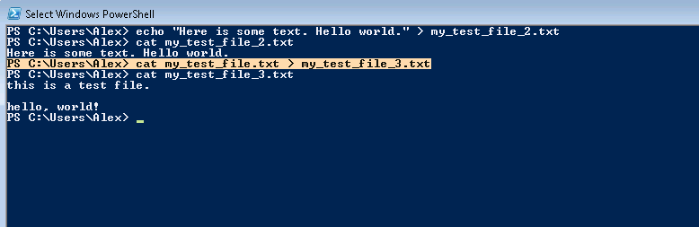
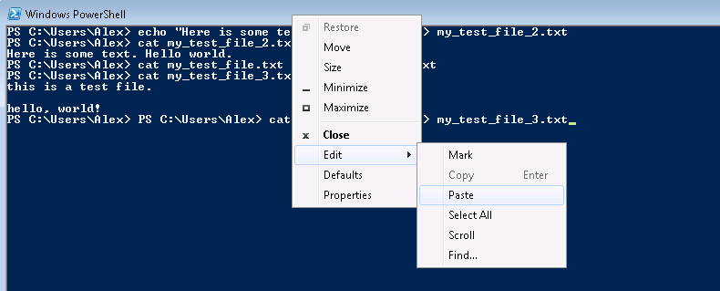

### Using a buffer with Power Shell: copying and pasting text.

To copy text, point cursor to the beginning of the selection, drag the mouse while holding the button. Once selection is complete hit 'Enter' on the keyboard.
The text will be copied in the buffer.

Pasting text into shell window can be accomplished by right-clicking on window title then selecting Edit -> Paste

## Deleting Files & Directories

Deleting files and directories is done with the following command

rm -- delete a file, or delete files directories recursively
rmdir -- delete empty directories

### Creating first python program.

Brief digression -- [Install Python 2.7](0006_install_python.md)

Another brief digression, install a text editor -- [Install Notepad++](0007_install_notepadpp.md)

# Exercises

* Create a test text file file with Windows Explorer
* Copy the file name from windows explorer by right-click
* Delete the file by pasting its name into Power shell

# References

* http://swcarpentry.github.io/shell-novice/
* http://cc.vrplumber.com/scripts.html#getting-to-the-command-prompt
* http://swcarpentry.github.io/shell-novice/01-filedir.html

|Previous|Next|
|--------|----|
|[Directories](0004_files.md)|[README](../README.md)|