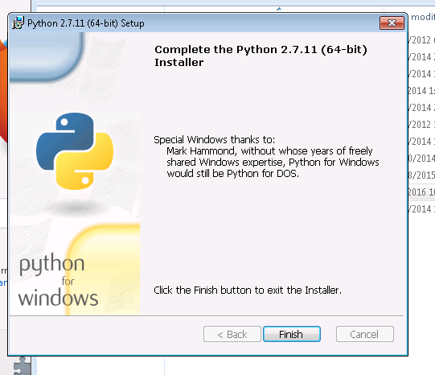

Python installation instructions for Windows
========

Verify that python in installed on the system by going through steps 12 & 13.

If you see item Python (command line) in your start menu or after typing **python** in 'Search programs and files' (Step 12), and you are able to run python.exe shell from Power Shell (Step 13) then you already have python installed, if not go through steps 1 - 11

### Step 1

Download the latest version of Python 2.7:

From python.org -- https://www.python.org/downloads/release/python-2711/

Direct link -- https://www.python.org/ftp/python/2.7.11/python-2.7.11.amd64.msi

### Step 2

Save the file on the disk.

### Step 3

Go to the the folder where the file was downloaded

### Step 4

Run the installer. Right-click -> Install.

If you are running as a regular (unprivileged user), you may need to run the installer system-wide, which requires Administrator privilege.

In order to get to Administrator mode, press 'Shift' on the keyboard and right-click, a new menu item 'Run as Administrator' will appear. Choose that item, then enter your password.

### Step 5

Run installer as the Administrator

### Step 6

Select the option **Install for all users**

### Step 7

Don't change the default and use the default *C:\Python27* directory.

### Step 8

***REALLY IMPORTANT STEP***

Select deselected option **Add python.exe to Path*** and choose **Entire feature will be installed on local hard drive** then press next.

If you don't select the option, you woouldn't be able to run python scripts directly from Windows Power Shell.

### Step 9

Select 'Yes' when *User Access Control* comes up.

### Step 10

Wait for Python install to finish

### Step 11

Press 'Finish' when python installer is done.

### Step 12

Verify that Python interpreter (command line) is available in 'Start Menu', if it's not immediately available, type 'Python' in *Search programs and files*

### Step 13

Verify that Python interpreter can be run from Windows PowerShell, by starting PowerShell and then typing **python.exe** if you see Python interpreter prompt, it means that Python was install successfully. Type **exit** to quit python interpreter.

