Notepad++ installation instructions
=========

Notepad++ is a text and source code editor, unlike built-in Notepad, it's generally not annoying and is actually useful for editing the source code having such features as syntax highlighting, syntax checking and code completion.

Follow [Step 6](#step-6) and [Step 7](#step-7) to verify that Notepad++ is installed on your system -- basically type notepad++ in *Search programs and files* field, if you see Notepad++ icon (not Notepad!), you have the text editor installed, if not -- install it on your computer by following steps 1 through 5.

### Step 1

Download the latest version of Notepad++ (current 6.8.8)

From notepad-plus-plus.org -- https://notepad-plus-plus.org/download/v6.8.8.html

Direct link -- https://notepad-plus-plus.org/repository/6.x/6.8.8/npp.6.8.8.Installer.exe

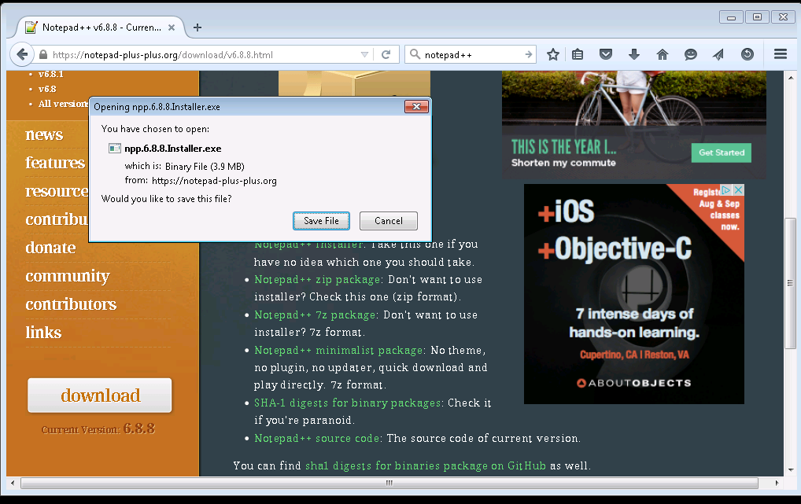

### Step 2

Save the file on the disk.

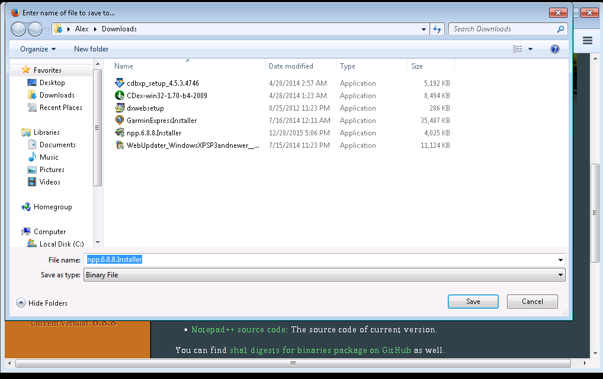

### Step 3

Right-click on the installer icon and run the installer as an Administrator. If this option doesn't appear. Press 'Shift' and then right-click on the icon again.

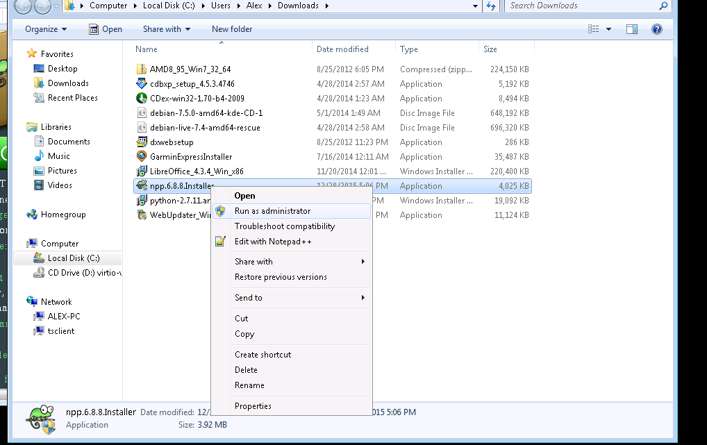

### Step 4

Select 'Yes' in case *User Access Control* warning comes up.

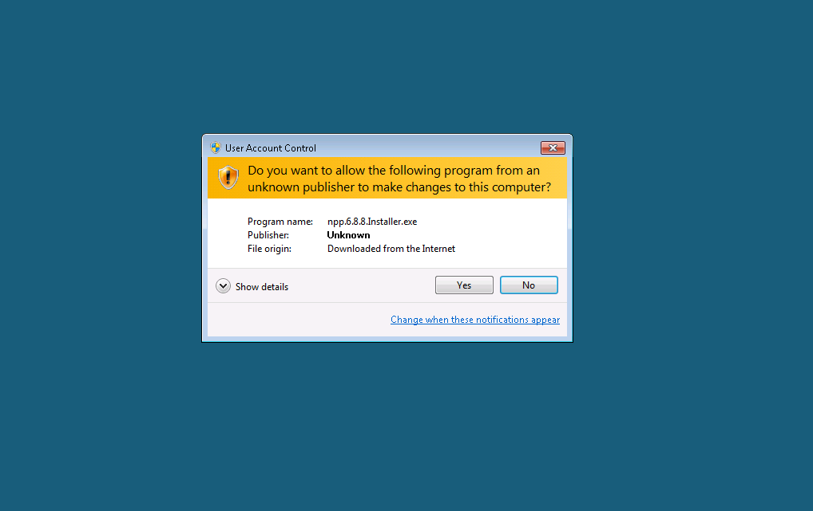

### Step 5

Follow Notepad++ installer procedures

Select the language.

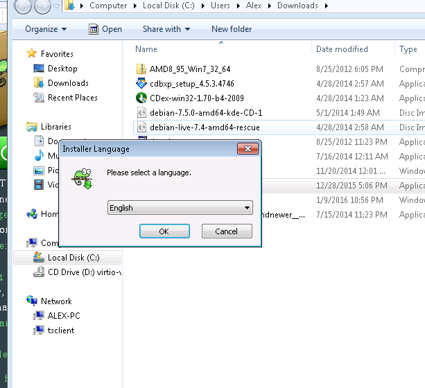

Continue with the installation by pressing 'Next'.

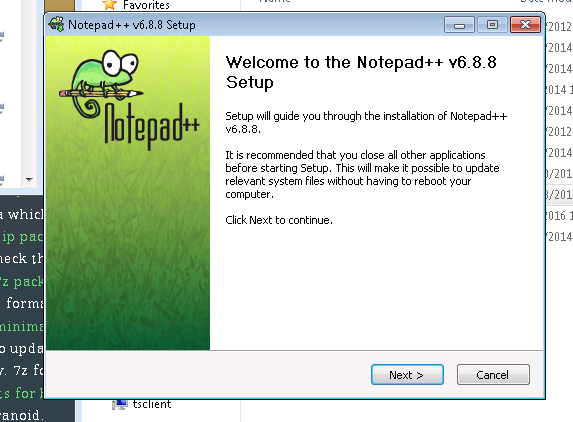

Continue with the installation by pressing 'I Agree'.

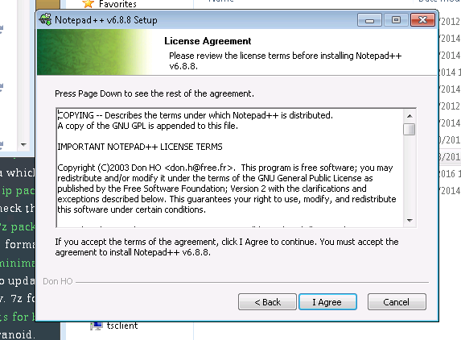

Use the default installation location, don't change the default Destination Folder, just press 'Next'.

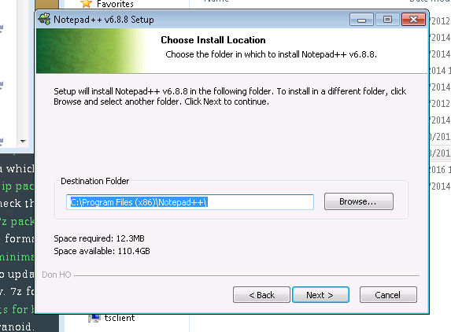

Use default component selection, don't change the type of install or selected components to be installed, just press 'Next'

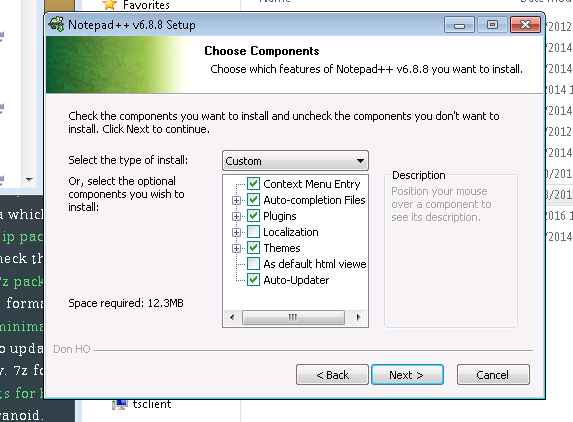

Use the defaults and don't select any extra components, just press 'Next'.

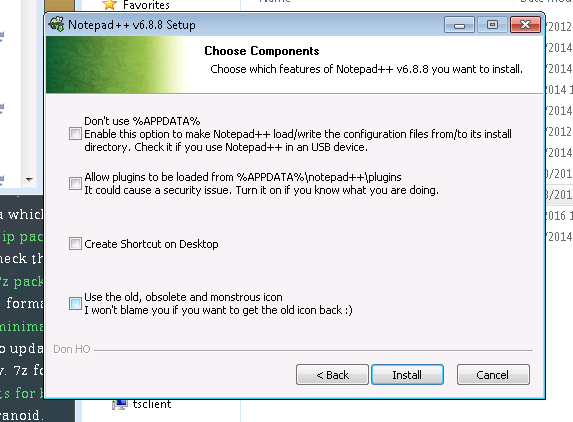

Wait for the installer to extract and copy all the files on the system, once it's done press 'Finish'.

### Step 6

Verify that Notepad++ comes up when you type 'notepad' in Start Menu -> *Search programs and files*

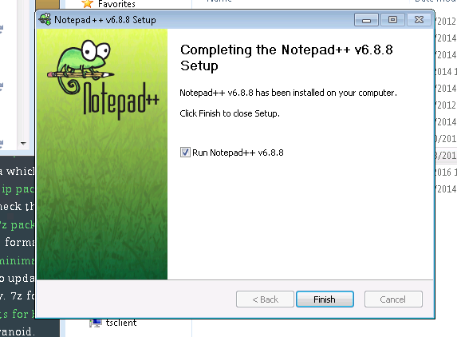

### Step 7

Click on Notepad++ icon and make sure it runs

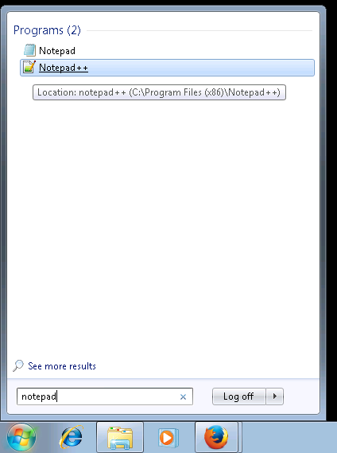